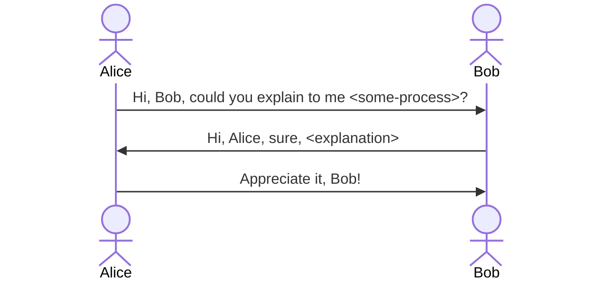
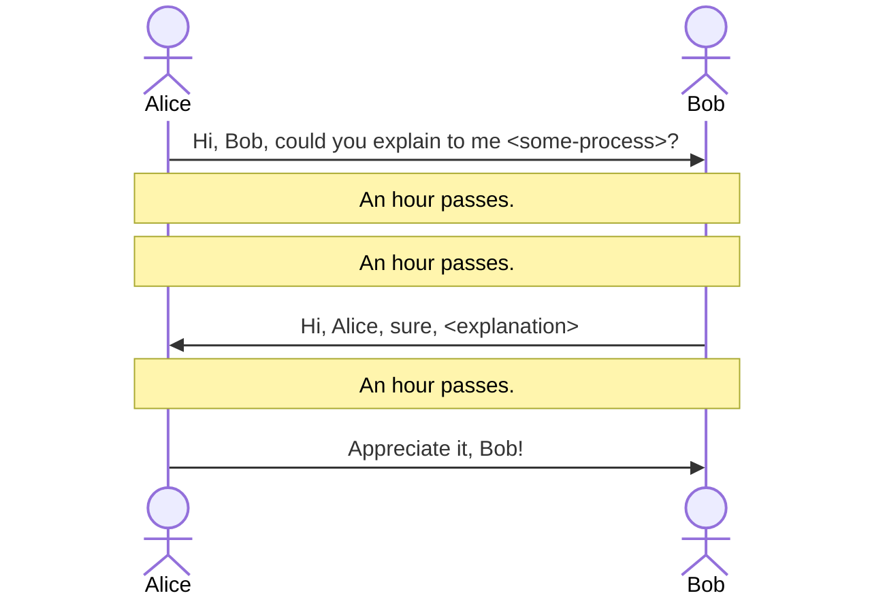
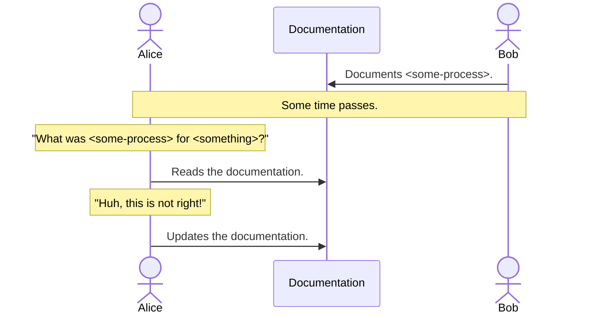

## What is asynchronous communication?

Simply put, asynchronous communication is **communiation which doesn't happen in real time.**

This is very simplistic!

Credit: [Shopify](https://shopify.engineering/asynchronous-communication-shopify-engineering)

An alternative [definition](https://remote.com/blog/elements-sustainable-remote-work-culture):
> Asynchronous work is a simple concept: Do as much as you can with what you have, document everything, transfer ownership of the project to the next person, then start working on something else.

## Benefits of asynchronous communication

[//]: # (Most of what I'll say here is taken from GitLab's guide to asynchronous communication in GitLab's open employee handbook. It is the best guide I have seen for asynchronous communication, both in terms of depth and breadth of the topic. I have referenced it in the References section below.)

### 1. Autonomy, empowerment, and agency

> All-remote settings empower team members to live and work where they're most fulfilled. Team members are given agency to move projects forward on a schedule that suits them.

[//]: # (If someone is traveling to a new time zone each month, or chooses to spend a beautiful afternoon with family, that's their prerogative. To further optimize this approach, consider adding a "no ask, must tell" time off policy, which means team members do not need to ask permission to step away from work.)

[//]: # (Increasingly, operating asynchronously is necessary even in colocated companies which have team members on various floors or offices, especially when multiple time zones are involved.)

### 2. Increased efficiency and productivity

> "There are many times when work isn’t ready for us to tackle, tasks aren’t planned, decision makers aren’t online, etc. In these times, successful teams execute, even if they later have to refactor and adapt, they don’t waste time “waiting”.
'Always default to action' is a mantra we keep on repeating at [Remote](https://remote.com/)."

### 3. Inclusivity
Differences in time zones or working patterns are reduced or can be completely eliminated. **It's harder to "not be in the room" when "the room" doesn't exist.**

[//]: # (One of the biggest benefits of asynchronous work is that it completely removes the hurdle of time zones.)

[//]: # (Business happens around the clock, in all time zones, in perpetuity. Attempting to shoehorn communications into a single time zone's predefined set of hours is dysfunctional.)

[//]: # (It robs people of their autonomy and flexibility (requiring folk to be always on at the same time prevents them from prioritising work and non-work priorities according to their own best interest) People and teams can spend a lot of time being blocked while waiting for a key person or a team. People across timezones can be excluded from important meetings of not be in the room when important decisions are made. Documentation suffers - a lot of times decisions are not captured in a written form or processes are not documented because it is assumed that the knowledge stays with those present in a meeting. 
)

### 4. Less stress = better mental health
> A tremendous amount of stress comes with expectations to be online, available, and responsive during set working hours. Worse, our hyper-connected society has allowed this notion to seep into every hour of the day, destroying boundaries between work and self.

[//]: # (An asynchronous mindset enables everyone to take a step back and assume that whatever we're doing is done with no one else online. It removes the burden of an endless string of messages you must respond to immediately. We all have a little more breathing room to do deep work that requires long periods of uninterrupted time.)

### 5. Thoughtfulness and intentionality are encouraged
[//]: # (Here are some quotes from Sahil Lavingia, founder/CEO at.)

> All communication is thoughtful. Because nothing is urgent (unless the site is down), comments are made after mindful processing and never in real-time. There's no drama.

> Because everyone is always effectively "blocked," everyone plans ahead. It also means anyone can disappear for an hour, a day, or a week and not feel like they are holding the company back. 

### 6. The knowledge gap is reduced or eliminated
[//]: # (Low context culture)

> Team members forecast what questions may be asked about a communique and add in as much context as possible in its delivery. 
By assuming that the recipient is asleep, or perhaps doesn't even work at the company yet, this added context removes ambiguity and decreases the likelihood of misinterpretation.

[//]: # (This may feel inefficient, as crafting a message may take longer to compose and edit. However, the long-term benefits are remarkable. Decisions are documented over years, making them easier to be discovered and referenced. New people are enabled to self-learn. )

[//]: # (Synchronous organizations often make decisions in a series of meetings, documenting little to nothing along the way, such that those who come into the process mid-stream are constantly wasting cycles on fact-finding missions. Plus, those hired after a significant decision is made cannot understand the context of something that was changed before their arrival, creating cavernous knowledge gaps that eat away at a company's efficiency.)

## Write things down!

[//]: # (A theme has run through all of the benefits I listed above - writing things down. There are 3 key takeaways I want people to get out of this presentation. The first one is: write things down!)

The term "asynchronous communication" is just a fancy way of saying "allow for flexibility, and most importantly - write things down".

[//]: # (In a lazy rehashing of the benefits above, let me geek out a bit when it comes to writing things down.)

#### Writing things down makes the implicit explicit
* Instead of information living in the heads of different people, with varying degrees of consisteny between what each person thinks, it is brough out in to the open.

[//]: # (If what you write down is the truth and it is agreed by all parties - great, you've got documentation now for future reference. If it is wrong - even better - you found out earlier and can address any concerns ahead of time. Tanya Reilly, a Senior Principal Engineer from Squarespace says that "being wrong is better than being ambiguous" - and she is spot on!)

#### It is a great unblocker
* Instead of a few key people keeping information in their heads and blocking everyone who needs access to it, **knowledge is transparent and owned by everyone**.

#### Your future self will thank you
[//]: # (We tend to overestimaate the length of time information will stay in our heads. In reality, we forget things all the time. )

* We forget things all the time - **look up, don't relearn**!

#### It is a way to scale a (remote) organisation
* Keeping a lineage of why decisions were made, how processes work and fostering a culture of writing thigs down can make or break the effort to scale a company.

[//]: # (When a company is small, information tends to be distributed orally and a lot of it is in the heads of individual people. As a  company scales, and there is an explosion of new teams and new domains to be explored, a lot of knowledge gets lost.)

[//]: # (A culture of writing things down can help with this. As companies scale, people will come and go. By utilizing asynchronous communication, an organization is able to retain knowledge throughout these natural cycles.)

## Examples

<dl>
<dt>Setting an agenda for meetings</dt>
<dd>What are we all meeting for? Setting an agenda is useful to set expectations and to ensure a relevant outcome is achieved.</dd>
<dt>Capturing meeting outcomes</dt>
<dd>What did we decide? What are the actions identified this meeting? If we don't write these down - what was the point of the meeting?</dd>
<dt>Code Reviews</dt>
<dd>Mostly relevant to the tech folk, but it's a form of asynchronous communication we do every day!</dd>
<dt>Collaborating on a Google Doc</dt>
<dd>Asynchronous collaboration at its finest!</dd>
<dt>Recording meetings</dt>
<dd>Not without its flaws, but it does help ensure knowledge is shared more equitably.</dd>
<dt>Slack/Email</dt>
<dd>The more permanent the message format, the longer its potential usefulness.</dd>
<dt>Documentation</dt>
<dd>Requires a strong culture to be maintained and expanded.</dd>
</dl>

## How to do it well

## When not to use it

## References
* https://mermaid.js.org/syntax/sequenceDiagram.html#styling
* https://about.gitlab.com/company/culture/all-remote/asynchronous/
* https://shopify.engineering/asynchronous-communication-shopify-engineering 

Potential themes if done in GH:
* https://github.com/pages-themes/time-machine
* https://github.com/jekyll/minima
* https://pages-themes.github.io/leap-day/
* https://pages-themes.github.io/cayman/
* https://github.com/pages-themes/architect 

[//]: # (
Asynchronous communication is a culture change. 

From Shopify: "Yet, multiple mediums of communication incur many choices in how to use them effectively. When you have the option to communicate via chat, email, collaborative document or GitHub issue, picking the right one can become overwhelming and frustrating. Therefore we encourage our teams to establish their preferred norms and to write them down."
)